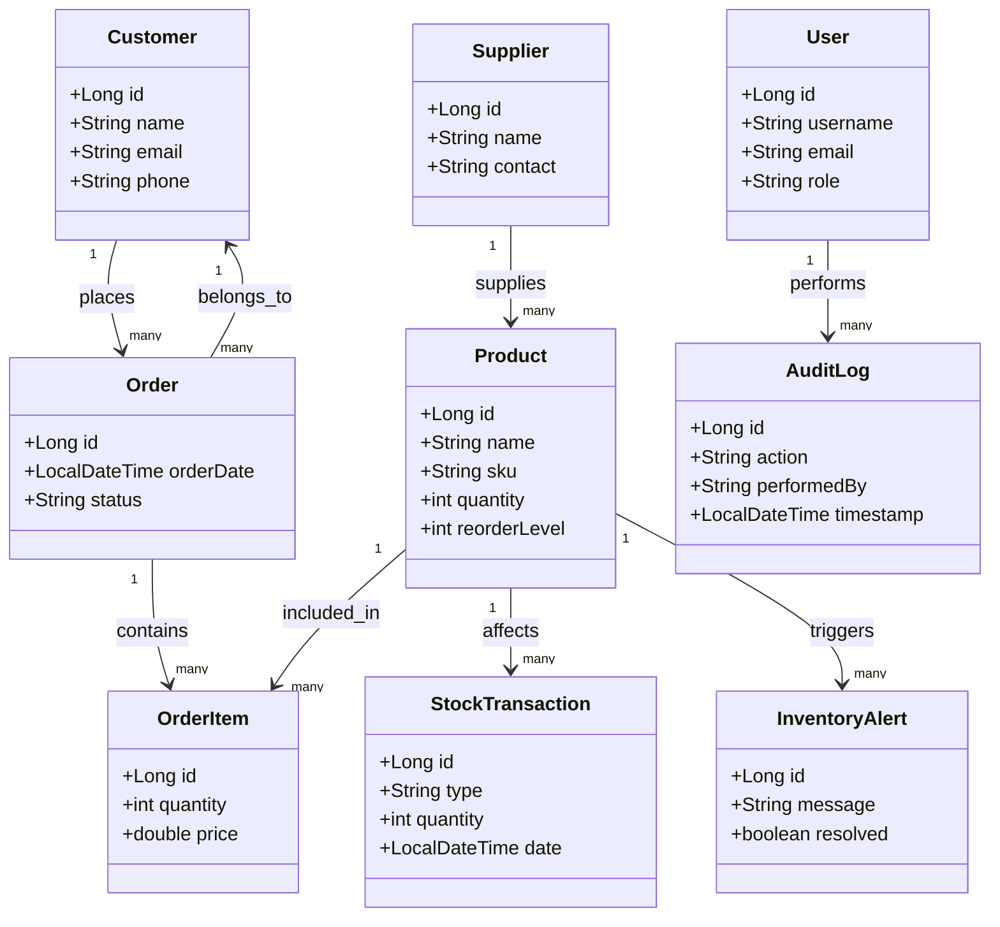

#  Inventory & Order Management System  

This project is a **RESTful backend** for an **Inventory & Order Management System** built using **Spring Boot**, **Spring Data JPA**, **Spring Security (JWT)**, and **PostgreSQL**.  
It helps businesses manage products, suppliers, customers, and stock operations with a clean, scalable backend architecture.  

---

##  Features

###  Authentication & Authorization
- **JWT-based Authentication** for secure login and registration.
- **Role-based Access Control (RBAC)** — `ADMIN`, `MANAGER`, and `STAFF`.
- All sensitive endpoints are secured and require valid JWT tokens.

###  Inventory Management
- Manage **products** with details like SKU, category, price, and reorder level.
- **Inventory alerts** are automatically triggered when stock drops below a threshold.
- Real-time tracking of stock transactions (inbound and outbound).

###  Supplier & Customer Management
- Manage suppliers and customers with full CRUD functionality.
- Maintain important contact information and relationship records.

###  Order & Transaction Management
- Create and manage customer orders and supplier purchases.
- Automatically adjust product stock based on transactions.
- Maintain full history of stock movements (in/out).

###  Audit & Alert System
- **AuditLog** keeps track of important actions with user and timestamp.
- **InventoryAlert** notifies when a product’s quantity falls below its reorder level.

###  Additional Highlights
- Centralized **Global Exception Handling** for consistent API error responses.
- Uses **DTOs + MapStruct Mappers** for clean, layered architecture.
- Built with scalability and production readiness in mind.

---

##  Architecture Overview

The project follows a **modular, layered architecture** with clear separation of concerns:

## Technologies Used
    
    Java 21
    
    Spring Boot 3
    
    Spring Data JPA
    
    Spring Security with JWT
    
    PostgreSQL
    
    MapStruct
    
    Lombok
    
    Maven

## API Endpoints
  ### Authentication
    
    POST /api/auth/register → Register a new user
    
    POST /api/auth/login → Authenticate and obtain JWT token

  ### Products
    
    GET /api/products → Retrieve all products
    
    GET /api/products/{id} → Retrieve product details by ID
    
    POST /api/products → Create a new product (Admin only)
    
    PUT /api/products/{id} → Update product details (Admin only)
    
    DELETE /api/products/{id} → Delete a product (Admin only)

 ### Suppliers

    GET /api/suppliers → List all suppliers
    
    GET /api/suppliers/{id} → Get supplier by ID
    
    POST /api/suppliers → Create new supplier
    
    PUT /api/suppliers/{id} → Update supplier details
    
    DELETE /api/suppliers/{id} → Delete supplier

 ### Customers

    GET /api/customers → Retrieve all customers
    
    GET /api/customers/{id} → Get customer details
    
    POST /api/customers → Create a new customer
    
    PUT /api/customers/{id} → Update customer details
    
    DELETE /api/customers/{id} → Delete customer

 ### Orders

    GET /api/orders → Retrieve all orders
    
    GET /api/orders/{id} → Retrieve a single order
    
    POST /api/orders → Create new order
    
    PUT /api/orders/{id}/status → Update order status

 ### Reports

    GET /api/reports/low-stock → View low-stock report
    
    GET /api/reports/sales → View sales totals by date range

 ### Stock & Transactions

    POST /api/stock/transactions → Record stock adjustment (in/out)
    
    GET /api/stock/transactions → View all stock transactions

## Security Design

    Passwords hashed with BCrypt.
    
    JWT authentication using Bearer tokens.
    
    Role-based method security using annotations like:
        @PreAuthorize("hasRole('ADMIN')")

